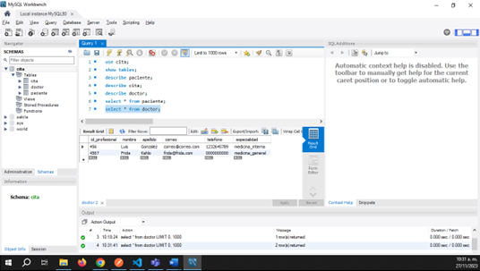
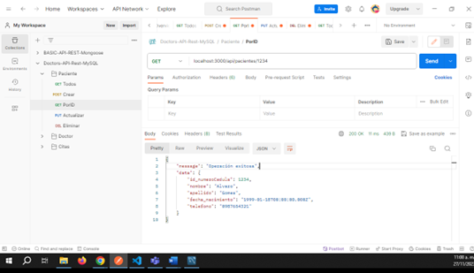

README

# API REST Citas Consultorio Médico


Tecnologías utilizadas:

- Node, Express, Typescript, MySQL y Sequelize como ORM Basico REST API
- CRUD Operations (A Controller for this)
- SQL for database: Relational MySQL - Use ORM Sequelize

> Creado por:
José David Mejía Meneses
Alejandro Rey Vera
Giovanna Astrid Rueda C.
, 2023.
>


Guía paso a paso para crear una API REST básica con TypeScript, Node.js, Express.js y Sequelize ORM para MySQL:

1. Clonar este repositorio utilizando el siguiente comando en Git:
```bash
 git clone https://github.com/DavidMejiaBogota/doctors.git
```

1. Instalar el paquete requerido :
```bash
 npm install
```
Now run the npm command to start the project :
```bash
 npm run dev
```🎉 Open postman and test the rest api on this url `https://127.0.0.1:3000`**

1. Inicializa tu proyecto Node.js** con el comando `npm init`. Este comando te guiará para crear un archivo `package.json` que contendrá las configuraciones básicas de tu proyecto.

2. Instala las dependencias necesarias** para tu proyecto con el siguiente comando:
npm i express nodemon body-parser mysql2 dotenv cors swagger-jsdoc swagger-ui-express

Esto instalará Express.js (un marco de aplicación web), 
nodemon (para reiniciar automáticamente tu servidor), 
body-parser (para analizar el cuerpo de las solicitudes HTTP), 
mysql2 (un controlador MySQL para Node.js), 
dotenv (para manejar variables de entorno), 
cors (para habilitar CORS), 
y swagger-jsdoc y swagger-ui-express (para la documentación de la API).

5. Instala Sequelize y Sequelize-Typescript con el comando `npm install sequelize sequelize-typescript`. Sequelize es un ORM para Node.js que soporta la sintaxis de ES6, ES7 y TypeScript.

6. Instala ts-node y nodemon como dependencias de desarrollo con el comando `npm install --save-dev ts-node nodemon`. Ts-node te permite ejecutar TypeScript directamente, mientras que nodemon reiniciará tu servidor automáticamente cada vez que hagas un cambio en tu código.

7. Instala TypeScript como una dependencia de desarrollo con el comando `npm install typescript --save-dev`.

8. En la terminal Instala los tipos de TypeScript para tus dependencias con el comando:
npm i @types/node @types/express @types/body-parser @types/mysql @types/dotenv @types/cors @types/swagger-ui-express @types/swagger-jsdoc --save-dev

Esto te permitirá utilizar TypeScript con Node.js, Express.js, body-parser, mysql, dotenv, cors, swagger-ui-express y swagger-jsdoc.

9. Inicializa tu configuración de TypeScript con el comando `npx tsc --init`. Esto creará un archivo `tsconfig.json` en tu proyecto.

10. Configura las opciones del compilador de TypeScript** en tu archivo `tsconfig.json`:
```json
"compilerOptions": {
    "target": "es6",   
    "module": "commonjs",
    "outDir": "./dist",
    "strict": true,
    "esModuleInterop": true,
    "experimentalDecorators": true,
    "emitDecoratorMetadata": true,
}
```
Esto configurará TypeScript para compilar a ES6, utilizar módulos CommonJS, emitir archivos compilados a la carpeta `./dist`, habilitar todas las comprobaciones de tipo estrictas, habilitar la interoperabilidad de módulos ES, y habilitar los decoradores experimentales y la emisión de metadatos de decoradores.

11. Configura los scripts de tu proyecto** en tu archivo `package.json`:
```json
"scripts": {
    "start": "tsc && nodemon dist/app.js",
    "dev": "tsc && nodemon app.ts"
}
```
Esto te permitirá iniciar tu proyecto con `npm start` y ejecutar tu proyecto en modo de desarrollo con `npm run dev`.

12. Crea un archivo `.env`** para almacenar tus variables de entorno.

13. Crea un archivo `.gitignore`** para especificar los archivos y directorios que Git debe ignorar.


14. Debes tener creada unicamente la base de datos. El ORM se encarga del mapeo entre la especificación en código y la base de datos MySQL.

La base de datos para este ejemplo se llama `cita`.

Debes tener instalado Swagger.

```bash
npm install swagger-jsdoc swagger-ui-express
npm install @types/swagger-ui-express @types/swagger-jsdoc --save-dev
```

Luego debes importarlo en el proyecto en `app.ts`:

```typescript
import swaggerUi from 'swagger-ui-express';
import * as swaggerDocument from "./src/swagger.json";
```

Si te aparece el problema de `Cannot find module './src/swagger.json` es por la importación de un archivo JSON en TypeScript.

En TypeScript, por defecto, no se pueden importar archivos JSON directamente. Para solucionar este problema, debes habilitar la opción `--resolveJsonModule` en tu archivo de configuración de TypeScript (`tsconfig.json`).

Finalmente agrega la ruta para la documentación con Swagger.

```typescript
app.use('/api-docs', swaggerUi.serve, swaggerUi.setup(swaggerDocument));
```

Con esto, podrás acceder a la documentación de Swagger en la ruta `/api-docs` de tu aplicación.

Te recomiendo que consultes la [documentación de `swagger-ui-express`](https://www.npmjs.com/package/swagger-ui-express) para obtener más detalles.


Modelo de la base de datos:


Modelo relacional:
doctor: id_profesional, nombre, apellido, correo, telefono, especialidad
paciente: id_numeroCedula, nombre, apellido, fecha_nacimiento, telefono
cita: fecha_hora, id_profesional, id_numeroCedula

Usando DDL se definió la estructura de datos. Ejecutamos el fichero cita.sql en la shell de MySQL.

seguimos las instrucciones y pasos a continuación:

Eliminar la base de datos 'cita' si existe

DROP DATABASE IF EXISTS cita;
Crear la base de datos 'cita'

CREATE DATABASE IF NOT EXISTS proveedores CHARACTER SET utf8mb4;
Seleccionar la base de datos 'cita' para usarla

USE cita;
Crea la tabla doctor:
CREATE TABLE doctor (
 id_profesional INT NOT NULL,
 nombre VARCHAR(50) NOT NULL,
 apellido VARCHAR(50) NOT NULL,
 correo VARCHAR(50) NOT NULL,
 especialidad ENUM('medicina_interna', 'medicina_general') NOT NULL,
 PRIMARY KEY (id_profesional)
);

Crea la tabla paciente:
CREATE TABLE paciente(
 id_numeroCedula INT NOT NULL,
 nombre VARCHAR(50) NOT NULL,
 apellido VARCHAR(50) NOT NULL,
 telefono VARCHAR(15) NOT NULL,
 fecha_nacimiento DATE NOT NULL,
 PRIMARY KEY (id_numeroCedula)
);

Crea la tabla cita:
CREATE TABLE cita (
 fecha_hora DATETIME NOT NULL,
 id_profesional INT NOT NULL,
 id_numeroCedula INT NOT NULL,
 FOREIGN KEY(id_profesional) REFERENCES doctor (id_profesional),
 FOREIGN KEY(id_numeroCedula) REFERENCES paciente (id_numeroCedula),
 PRIMARY KEY(id_profesional, id_numeroCedula, fecha_hora)
);


Pruebas postman

Con el objetivo de realizar las pruebas y validaciones del adecuado funcionamiento de la APP Doctors, se realiza un paquete de pruebas con el cliente Postman y el servidor de la aplicación, verificando los tres modelos existentes: Doctores, Pacientes y Citas, a continuación se plasma evidencia del proceso:

### CRUD Doctor


1.	Consultar todos los doctores de la base de datos:


2.	Agregar un doctor:


3.	Consulta a la bd a tabla doctor en la bd cita:


4.	Consultar listado de todos los doctores:


5.	Consulta de doctor por id:


6.	Editar/Actualizar información de doctor:


7.	Consulta de verificación de actualización de doctor a la BD en la tabla doctor:





8.	Eliminación de doctor:


9.	Consulta de verificación de eliminación de doctor a la bd doctor en la tabla doctor:


### CRUD Paciente

1.	Consulta al listado de pacientes:


2.	Consulta del listado de pacientes a BD cita en la tabla paciente:


3.	Creación paciente:


4.	Consulta de verificación de paciente creado a la bd cita en la tabla paciente:


5.	Consulta listado de todos los pacientes:


6.	Consulta  de verificación de listado de todos los pacientes a la bd cita en la tabla paciente:


7.	Consulta de paciente por id:





8.	Actualizar paciente:


9.	Consulta de verificación de actualización de datos a la BD en la tabla paciente:


10.	Eliminar paciente:


11.	Consulta de verificación de eliminación a la BD en la tabla paciente:


### CRUD Citas


1.	Consultar conexion módulo cita:


2.	Agregar una cita:


3.	Agregar una nueva cita:


4.	Consultar lista de citas en la base de datos:


5. Editar cita


6.	Editar cita por id_numeroCedula:


7.	Eliminación cita del 2023-11-26 Hora:10:40 :


8.	Consulta de verificación de eliminación cita en la tabla cita:


9.	Consultar una única cita por los tres parámetros query– método de sequelize “ findOne”:


10.	 Error por integridad Referencial: En la cita le asignamos un doctor que no existe en la base de datos:


